# **Parking Management Subsystem**
## Chapter 1 Problem Definition
### 1.1 Business survey
With the development of society and the improvement of people's living standards, buying a car has become one of people's goals. Of course, many people have already bought a car. However, as the number of vehicles increases, vehicle parking problems also arise. People's lifestyles are undergoing profound changes. Urban transportation is one of the phenomena caused by this change. Traffic congestion and even chaos caused by the increase in transportation facilities in cities have brought great inconvenience to people's lives. This inconvenience forces people to seek high-tech and effective means to solve this inconvenience, which makes each parking lot need to be more advanced. , a more complete vehicle management system brings convenience to car owners and systemizes parking lot management. Therefore a parking management system was developed.
### 1.2 Requirements Statement
1. The car owner enters the parking lot: The car owner is outside the parking lot. The number of available parking spaces is displayed on the display outside the parking lot. If there are any free parking spaces, the car owner comes to the car stop and the system automatically recognizes the license plate number and records the time the vehicle entered the parking lot. With the license plate number, the car blocker is released, and the car owner enters the parking lot. If for some reasons, the system cannot recognize the vehicle, for example: the vehicle has not yet been registered and the vehicle uses a temporary license plate. In this case, the administrator is responsible for manually entering the vehicle information (license plate number, entry time, special circumstances note: not registered) or temporary license), no remarks are required unless there are special circumstances.
1. The car owner leaves the parking lot: When the car owner comes to the car stop again, the system automatically recognizes the license plate number, records the time when the vehicle leaves the parking lot, and calculates the parking fee. After the car owner completes the payment, the car stop is released and the car owner leaves the parking lot. If the above special circumstances occur, the administrator will manually process the input information, and the cost will be calculated by the system.
1. Administrators view vehicle information: Administrators log in to the system and can manage vehicle information (license plate number, entry and exit times, parking fees, special situation remarks), query vehicle information, add vehicle information, and delete vehicle information.
### 1.3 Business model
#### 1.3.1 Business model
### 1.3 Business model
#### 1.3.1 Business model
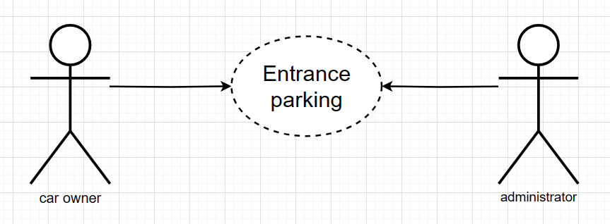
Figure 1-1 Business use case model
#### 1.3.2 Car Owner Business Activity Diagram
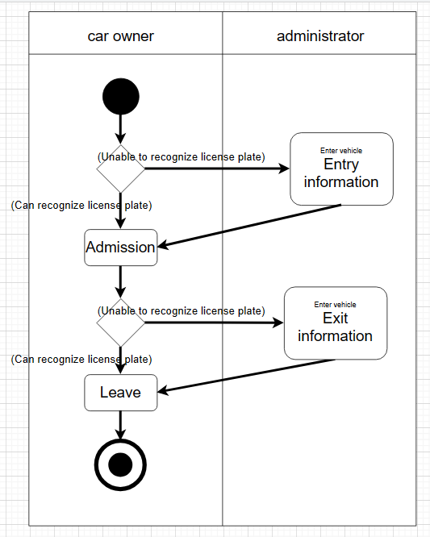  
Figure 1-2 Car Owner Business Activity Diagram
#### 1.3.3 Administrator business activity diagram
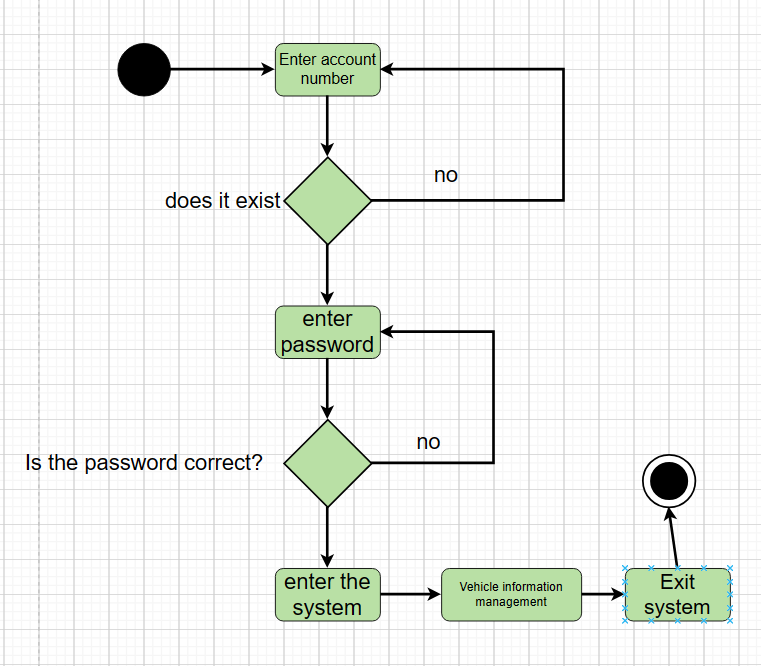 
Figure 1-3 Administrator business activity diagram
## Chapter 2 Requirements Analysis
### 2.1 System use case modeling (system use case modeling based on the analysis of 1.2)
#### 2.1.1 Overview of Participants
1. Car Owner-Parking Service
1. Administrator-manage information related to vehicle entry and exit
#### 2.1.2 Use case overview
1. The car owner comes to a parking lot with remaining parking spaces, enters the parking lot to park, pays the parking fee and leaves the parking lot
1. The administrator enters the correct account number and password to log in to the system and manage vehicle entry and exit information, including license plate number, entry and exit time, and parking fees.
#### 2.1.3 Use case relationship
Uploading...re-upload canceled 
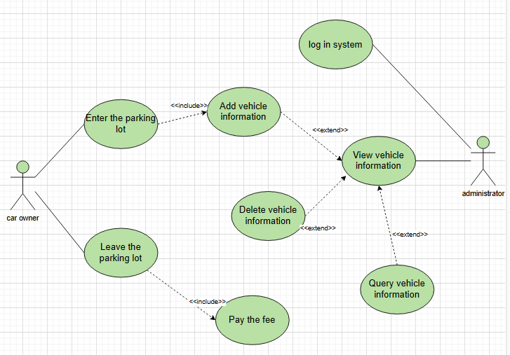   
Figure 2-1 System use case diagram
### 2.2 Use case specification description
Table 2-1 "Enter the parking lot" use case specification a

| Use case name: | Enter parking lot |
| :--- | :--- |
| **Use case id:** | P1 |
| **Participants:** | Car Owner |
| **Use case description:** | The car owner enters the parking lot |
| **Prerequisites:** | The car owner drives to the car stop |
| **Main event flow:** | 1. The car owner drives to the car stop and the use case starts. <br> 2. The system automatically recognizes the license plate number and records the license plate number and the time of entering the parking lot. <br> 3. After the recording is completed, the vehicle blocker is released. <br> 4. The car owner drove into the parking lot. |
| **Abnormal event flow:** | Unable to recognize license plate number |
| **Post-condition:** | Vehicle information recorded successfully |

Table 2-2 "Enter the parking lot" use case specification b

| Use case name: | Enter parking lot |
| :--- | :--- |
| **Abnormal event flow:** | The car owner drove to the car barrier and the system could not recognize the license plate number |
| 1. The car owner drives to the car stop and the use case starts. <br> 2. Enter vehicle information. <br> 3. After the recording is completed, the vehicle blocker is released. <br> 4. The car owner drove into the parking lot. |
| **Post-condition:** | Vehicle information recorded successfully |

Table 2-3 "Payment" use case specification

| Use case name: | Pay fees |
| :--- | :--- |
| **Use case id:** | P2 |
| **Participants:** | Car Owner |
| **Use case description:** | Car owner settlement fee |
| **Prerequisites:** | The car owner drives to the car stop |
| **Main event flow:** | 1. The car owner drives to the car stop and starts the use case. <br> 2. The system will automatically identify the license plate number, find relevant information about the vehicle entering the parking lot (license plate number, time of entering the parking lot), and record the time of leaving the parking lot. <br> 3. The system checks the vehicle information and calculates the parking fee. <br> 4. The car owner pays the parking fee. |
| **Exception event flow:** | None |
| **Post-conditions:** | Payment successful |

Table 2-4 "Leave the parking lot" use case specification

| Use case name: | Leaving the parking lot |
| :--- | :--- |
| **Use case id:** | P3 |
| **Participants:** | Car Owner |
| **Use case description:** | The car owner leaves the parking lot |
| **Prerequisite:** | The car owner paid successfully |
| **Main event flow:** | 1. After the car owner pays successfully, the use case starts. <br> 2. The car blocker releases and the car owner drives out of the parking lot. |
| **Exception event flow:** | None |
| **Postconditions:** | None |

Table 2-5 "Login" use case specification a

| Use case name: | Login |
| :--- | :--- |
| **Use case id:** | P4 |
| **Participants:** | Administrator |
| **Use case description:** | Administrator login system |
| **Preconditions:** | None |
| **Main event flow:** | 1. The administrator enters the login interface and the use case starts. <br> 2. When the administrator is not authenticated and the number of authentication attempts is less than or equal to three. <br> <pre> 1. The system requires the administrator to provide his administrator account and password. <br> 2. The administrator enters his or her administrator account and password. </pre> 3. The administrator account and password are correct. <br> 4. The system authenticates the administrator. |
| **Exception Event Flow:** | Administrator authentication failed. |
| **Post-conditions:** | The administrator logs in to the system. |

Table 2-7 "View vehicle information" use case specification

| Use case name: | View vehicle information |
| :--- | :--- |
| **Use case id:** | P5 |
| **Participants:** | Administrator |
| **Use case description:** | Administrator views vehicle information |
| **Prerequisite:** | The administrator has logged into the system |
| **Main Event Flow:** | 1. The use case starts when the administrator selects a vehicle type to browse. <br> 2. The system will display the vehicle information directory. |
| **Exception event flow:** | None |
| **Postconditions:** | None |

Table 2-8 "Query vehicle information" use case specification

| Use case name: | Query vehicle information |
| :--- | :--- |
| **Use case id:** | P6 |
| **Participants:** | Administrator |
| **Use case description:** | Administrator queries vehicle information |
| **Prerequisite:** | The administrator has logged into the system |
| **Main event flow:** | 1. The administrator selects "Find" and the use case begins. <br> 2. The administrator enters the searched license plate number. <br> 3. The system searches for vehicles that meet the conditions. <br> 4. The system displays vehicle-related information. <br> 5. Others <br><pre>5.1 The system tells the administrator that no matching vehicle was found</pre> |
| **Exception event flow:** | None |
| **Postconditions:** | None |

Table 2-9 "Enter vehicle information" use case specification

| Use case name: | Add vehicle information |
| :--- | :--- |
| **Use case id:** | P7 |
| **Participants:** | Administrator |
| **Use case description:** | The administrator manually enters vehicle information |
| **Prerequisite:** | The administrator has logged into the system |
| **Main event flow:** | 1. The administrator selects "Add information" and the use case starts. <br> 2. The system displays a form for filling in vehicle details, including license plate number and entry time (required),<br> 3. At the same time (new addition not completed)<br><pre>3.1 The administrator selects a field and add its value. <br> 1. The system asks the administrator to confirm the addition. <br> 2. The administrator selects OK. <br> 3. The system adds the new vehicle to the catalog. </pre> |
| **Exception event flow:** | None |
| **Post-conditions:** | New vehicle information has been added to the directory |

Table 2-10 "Delete vehicle information" use case specification

| Use case name: | Delete vehicle information |
| :--- | :--- |
| **Use case id:** | P8 |
| **Participants:** | Administrator |
| **Use case description:** | Administrator manually deletes vehicle information |
| **Prerequisite:** | The administrator has logged into the system |
| **Main event flow:** | 1. When the administrator selects "Delete information", the use case starts. <br> 2. The system asks the administrator for the vehicle identification code. <br> 3. The administrator enters the vehicle identification code. <br> 4. The system asks the administrator to confirm the deletion. <br> 5. The administrator selects OK. <br> 6. The system deletes vehicle details. |
| **Exception event flow:** | None |
| **Postconditions:** | The vehicle details have been deleted from the system. |
## Chapter 3 Object-oriented Analysis
### 3.1 Use case implementation
Use sequence diagrams to implement each use case according to the BCE architecture
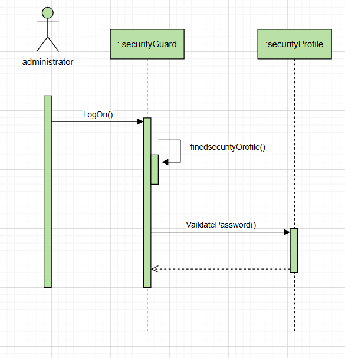   

Figure 3-1 Login sequence diagram

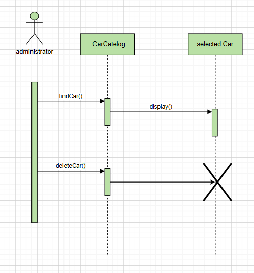  

Figure 3-2 Deleting vehicle information sequence diagram

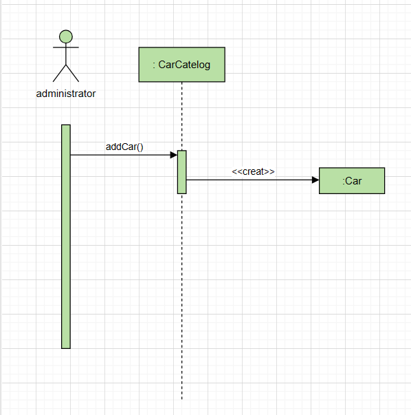 

Figure 3-3 Sequence diagram of adding vehicle information

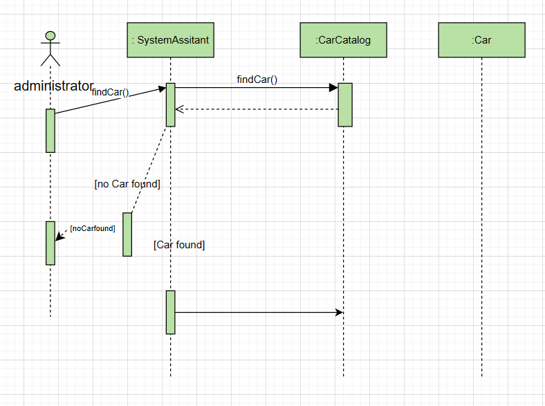  

Figure 3-5 Find vehicle information sequence diagram

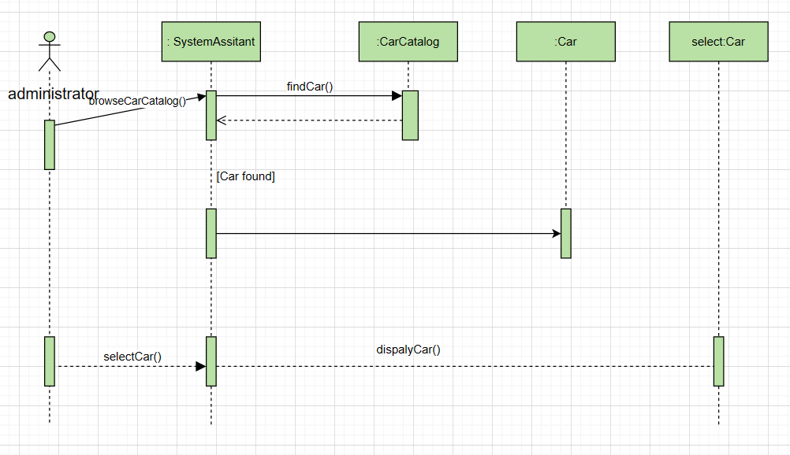   

Figure 3-6 Sequence diagram for viewing vehicle information
### 3.2 Analysis model
Establish a systematic analysis category diagram, assign responsibilities and attributes to each category, and model the relationships between categories
  

## Chapter 4 Object-Oriented Design
### 4.1 Database design
Database structure
1. Vehicle information table
   
| Column name | Data type | Can be empty | Description | Remarks |
| :---: | :---: | :---: | :---: | :---: |
| **Carin** | Datetime | Not null | Storage time | Master code |
| **Carout** | Datetime | | Carout time | |
| **carpay** | Float(20) | | Parking fee | |
| **carno** | Varchar(20) | Not null | License plate number | Master code |

Table 3.5 Vehicle information table

2. Administrator information table

| Column name | Data type | Can be empty | Description | Remarks |
| :---: | :---: | :---: | :---: | :---: |
| **rId** | varchar(20) | Not null | Administrator account | Master code |
| **password** | Varchar(20) | Not null | Password | |

Table 4.1 Administrator information table
### 4.2 Design class
Entity class

There are two entities in the class diagram obtained in the OOA stage, namely vehicle and administrator.

- Boundary class

1. Administrator login boundary category—LogOn.java
2. Vehicle information management—mainWindowsjava
3. Enter the vehicle information interface—addcar.java
4. Query vehicle information interface—findcar.java
5. Delete vehicle information interface—delcar.java

- Control class

1. Login control category - receives login requests, controls the status of the login process, calls the model, and forwards the request to the administrator login boundary class logOn.java.
2. Vehicle information management - receives the request, controls the execution status of vehicle information management, calls the model, obtains the processing result, and forwards the request to vehicle information management mainWindows.java.
3. Input vehicle information—Receive the input request, control the execution status of the input vehicle information, call the model, get the processing results, and forward the request to the input vehicle information addcar.java.
4. Query vehicle information—Receive the query request, control the execution status of querying vehicle information, call the model, obtain the processing results, and forward the request to FindCar.java for querying vehicle information.
5. Delete vehicle information—Receive the deletion request, control the execution status of deleting vehicle information, call the model, obtain the processing results, and forward the request to delete vehicle information DelCar.java.
### 4.3 Software architecture
This system uses the MVC design pattern to construct the program structure. The model is used to complete the encapsulation of business logic. The controller controls each program process, which is the implementation of the control category designed in the previous step. The view is used to display the page, which is the one designed in the previous step. Implementation of boundary categories.

In addition to the attribute encapsulation of the entity category designed in the previous step, the model part also needs to implement various methods corresponding to the entity category, classify all business functions, and design the beans for each business as follows.

carService implements services related to vehicle information management, including the following methods:
```
add_in()---Add a vehicle warehousing information to the vehicle information table.
Add_out()---Add a vehicle's outbound information to the vehicle information table.
FindCar()---Query vehicle information.
delCar()---Delete vehicle information.
lookCar()—View vehicle information.
```
### 4.4 Interactive interface design
1. Log in to logOn.java
   
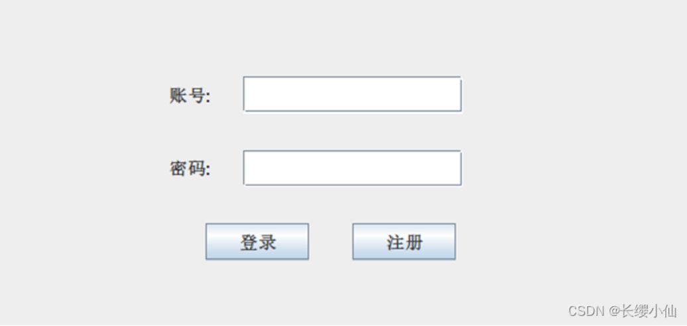 
 
Figure 4-1 Login interface design
2. Vehicle information management mainWindows.java

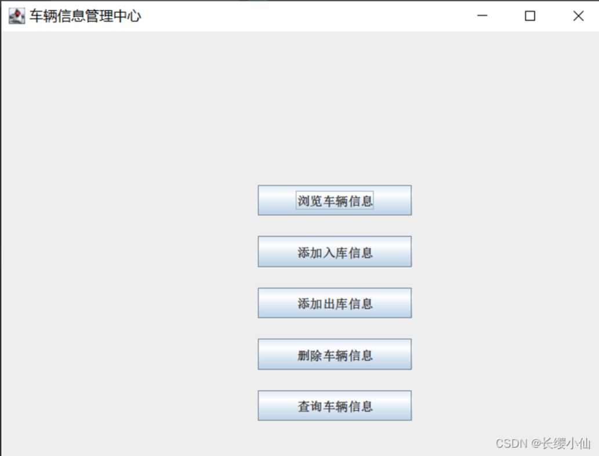 
Figure 4-2 Vehicle information management interface design 
  
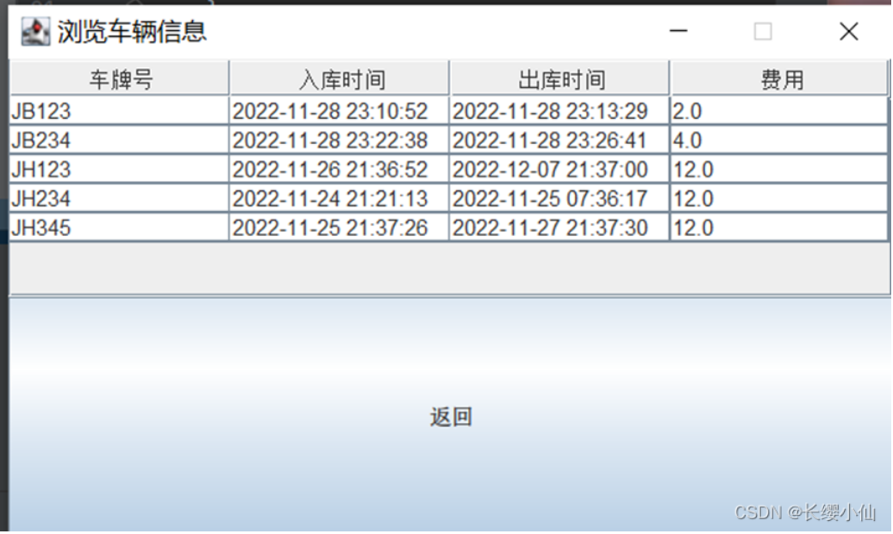  
Figure 4-3 Browsing vehicle information 
  
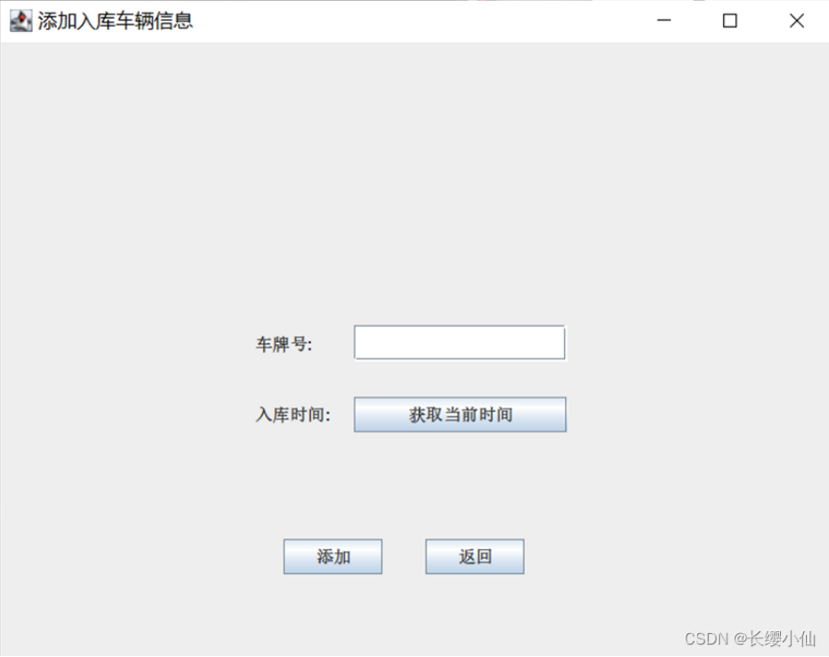 
Figure 4-4 Add vehicle information
   
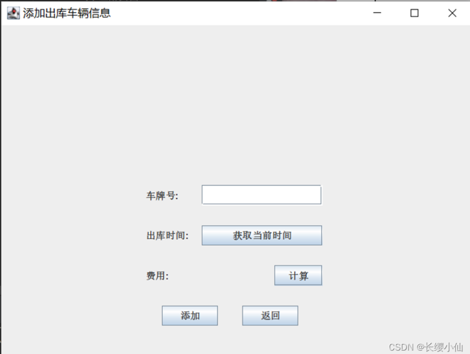  
Figure 4-5 Added outbound vehicle information
  
6. Delete vehicle information DelCar.java
   
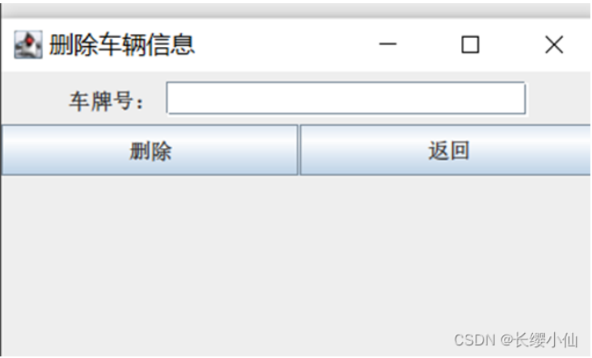 
Figure 4-6 Delete vehicle information

7. Query vehicle information findCar.java
   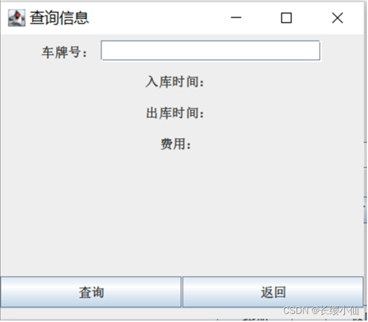  
Figure 4-7 Query vehicle information
## Chapter 5 Object-oriented Implementation
### 5.1 Coding implementation of parking lot information management system
This system is based on Java+MySQL+swing.
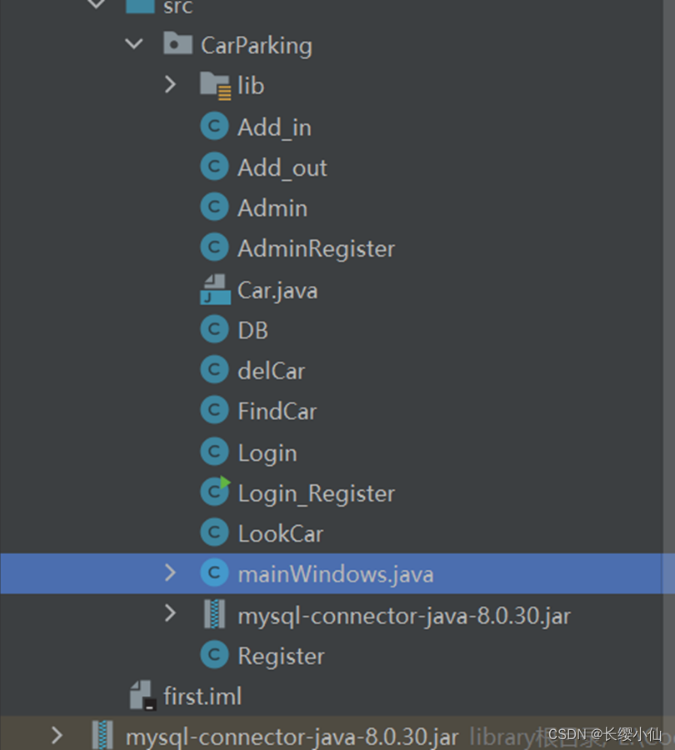 
## Chapter 6 Software Testing and Deployment
### 6.1 Software Testing
During the design and development process of this parking management system, the V model of software testing is used to standardize software testing. V-type advocates the parallel approach of development and testing. After developing a functional module, the corresponding unit test is conducted, paying attention to details. Then conduct integration testing, mainly testing whether the interfaces between modules can communicate with each other. Finally, functional testing is performed to detect whether the entire system is functioning properly.

During the testing process, functional testing is mainly used. Through functional testing, each function can be tested one by one to see whether it can meet the needs of parking lot managers.

### 6.2 Functional testing
Functional testing is a type of black-box testing, which is the process of designing test cases and verifying system functions based on software requirements, and through the relationship with the external input and output of the test system. Functional testing is to test whether the function is normal, so the internal implementation method is not considered. The premise of testing is that the system is already in operation.

This parking management system has tested the system functions many times during the design and development process to ensure the normal operation of the functions.

### 6.3 Summary of functional testing
Functional testing is mainly conducted on the login of the parking lot management system, vehicle entry, vehicle exit, and addition, deletion, modification and check of vehicle information. During the testing process, the display of the interface UI was in line with expectations, and the functions met the requirements.

### 6.4 Use case testing
6.4.1 Login use case test
| Test case number | Login_01 |
| :---: | :---: |
| Test Title | Enter the correct username and corresponding password |
| Preset conditions | This user exists in the system |
| Enter | Username:admin123<br>Password:123456 |
| Operation steps | Open the system login page and enter <br>username(admin123),password(123456) |
| Expected output | The password is hidden when entering, and the administrator logs in to the system homepage |
| **Test Case Number** | **Login_02** |
| Test title | Incorrect username or wrong password entered |
| Preset conditions | This user does not exist in the system |
| Input | Username:random<br>Password:random |
| Operation steps | Open the system login page and enter username and password |
| Expected output | Prompts the user "Login failed! Wrong username or password" |

6.4.2 Add information use case test

| Test case number | Add_01 |
| :---: | :---: |
| Test title | After adding, the information can be viewed on the page |
| Preset conditions | Administrator login successful |
| Input | Enter the information to be added |
| Operation steps | Click [Add], enter the corresponding message, and click [Add] |
| Expected output | Terminal output "Added successfully!" |

6.4.3 Query information use case test

| Test case number | Find |
| :---: | :---: |
| Test title | After entering the license plate number, you can see relevant messages |
| Preset conditions | The administrator has logged in successfully and the information being queried exists |
| Input | Corresponding license plate number |
| Operation steps | Enter the license plate number information to be queried and click [Search] |
| Expected Output | The interface displays its relevant information. |

6.4.4 Browse information use case test

| Test case number | Look |
| :---: | :---: |
| Test title | Browse all vehicle information |
| Preset conditions | The administrator has successfully logged in and the browsed information exists |
| Input | None |
| Operation steps | Click [Browse vehicle information] |
| Expected output | Browse the page to display all vehicle information details |

6.4.5 Delete information use case test

| Test case number | Delete |
| :---: | :---: |
| Test title | The message cannot be seen after confirming the deletion |
| Preset conditions | The administrator has logged in successfully and the deleted information exists |
| Input | None |
| Operation steps | Enter the license plate number information to be deleted and click [Delete] |
| Expected output | The terminal outputs "Deletion successful!", the information does not exist on the page |

### 6.5 Summary of this chapter
This chapter mainly introduces the necessity and test results of functional testing of the parking management system, and designs a series of functional test cases for the current parking management system. Through system testing, the system can better meet the expected requirements, and some bugs in the development process can be detected and fixed.
# Reference article
- https://blog.csdn.net/qq_61839797/article/details/128164668
