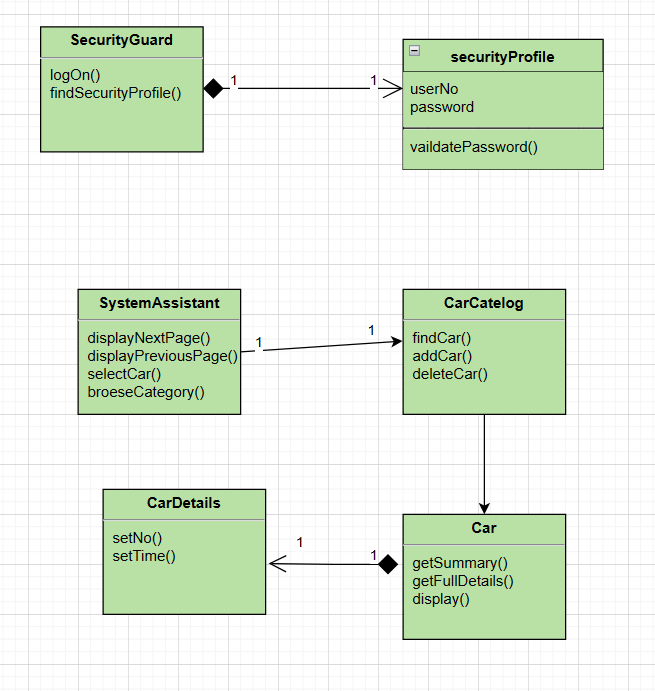

# **Parking Management Subsystem**
## Chapter 1 Problem Definition
### 1.1 Business survey
With the development of society and the improvement of people's living standards, buying a car has become one of people's goals. Of course, many people have already bought a car. However, as the number of vehicles increases, vehicle parking problems also arise. People's lifestyles are undergoing profound changes. Urban transportation is one of the phenomena caused by this change. Traffic congestion and even chaos caused by the increase in transportation facilities in cities have brought great inconvenience to people's lives. This inconvenience forces people to seek high-tech and effective means to solve this inconvenience, which makes each parking lot need to be more advanced. , a more complete vehicle management system brings convenience to car owners and systemizes parking lot management. Therefore a parking management system was developed.
### 1.2 Requirements Statement
1. The car owner enters the parking lot: The car owner is outside the parking lot. The number of available parking spaces is displayed on the display outside the parking lot. If there are any free parking spaces, the car owner comes to the car stop and the system automatically recognizes the license plate number and records the time the vehicle entered the parking lot. With the license plate number, the car blocker is released, and the car owner enters the parking lot. If for some reasons, the system cannot recognize the vehicle, for example: the vehicle has not yet been registered and the vehicle uses a temporary license plate. In this case, the administrator is responsible for manually entering the vehicle information (license plate number, entry time, special circumstances note: not registered) or temporary license), no remarks are required unless there are special circumstances.
1. The car owner leaves the parking lot: When the car owner comes to the car stop again, the system automatically recognizes the license plate number, records the time when the vehicle leaves the parking lot, and calculates the parking fee. After the car owner completes the payment, the car stop is released and the car owner leaves the parking lot. If the above special circumstances occur, the administrator will manually process the input information, and the cost will be calculated by the system.
1. Administrators view vehicle information: Administrators log in to the system and can manage vehicle information (license plate number, entry and exit times, parking fees, special situation remarks), query vehicle information, add vehicle information, and delete vehicle information.
### 1.3 Business model
#### 1.3.1 Business model
### 1.3 Business model
#### 1.3.1 Business model

Figure 1-1 Business use case model
#### 1.3.2 Car Owner Business Activity Diagram
  
Figure 1-2 Car Owner Business Activity Diagram
#### 1.3.3 Administrator business activity diagram
 
Figure 1-3 Administrator business activity diagram
## Chapter 2 Requirements Analysis
### 2.1 System use case modeling (system use case modeling based on the analysis of 1.2)
#### 2.1.1 Overview of Participants
1. Car Owner-Parking Service
1. Administrator-manage information related to vehicle entry and exit
#### 2.1.2 Use case overview
1. The car owner comes to a parking lot with remaining parking spaces, enters the parking lot to park, pays the parking fee and leaves the parking lot
1. The administrator enters the correct account number and password to log in to the system and manage vehicle entry and exit information, including license plate number, entry and exit time, and parking fees.
#### 2.1.3 Use case relationship
Uploading...re-upload canceled 
   
Figure 2-1 System use case diagram
### 2.2 Use case specification description
Table 2-1 "Enter the parking lot" use case specification a

| Use case name: | Enter parking lot |
| :--- | :--- |
| **Use case id:** | P1 |
| **Participants:** | Car Owner |
| **Use case description:** | The car owner enters the parking lot |
| **Prerequisites:** | The car owner drives to the car stop |
| **Main event flow:** | 1. The car owner drives to the car stop and the use case starts. <br> 2. The system automatically recognizes the license plate number and records the license plate number and the time of entering the parking lot. <br> 3. After the recording is completed, the vehicle blocker is released. <br> 4. The car owner drove into the parking lot. |
| **Abnormal event flow:** | Unable to recognize license plate number |
| **Post-condition:** | Vehicle information recorded successfully |

Table 2-2 "Enter the parking lot" use case specification b

| Use case name: | Enter parking lot |
| :--- | :--- |
| **Abnormal event flow:** | The car owner drove to the car barrier and the system could not recognize the license plate number |
| 1. The car owner drives to the car stop and the use case starts. <br> 2. Enter vehicle information. <br> 3. After the recording is completed, the vehicle blocker is released. <br> 4. The car owner drove into the parking lot. |
| **Post-condition:** | Vehicle information recorded successfully |

Table 2-3 "Payment" use case specification

| Use case name: | Pay fees |
| :--- | :--- |
| **Use case id:** | P2 |
| **Participants:** | Car Owner |
| **Use case description:** | Car owner settlement fee |
| **Prerequisites:** | The car owner drives to the car stop |
| **Main event flow:** | 1. The car owner drives to the car stop and starts the use case. <br> 2. The system will automatically identify the license plate number, find relevant information about the vehicle entering the parking lot (license plate number, time of entering the parking lot), and record the time of leaving the parking lot. <br> 3. The system checks the vehicle information and calculates the parking fee. <br> 4. The car owner pays the parking fee. |
| **Exception event flow:** | None |
| **Post-conditions:** | Payment successful |

Table 2-4 "Leave the parking lot" use case specification

| Use case name: | Leaving the parking lot |
| :--- | :--- |
| **Use case id:** | P3 |
| **Participants:** | Car Owner |
| **Use case description:** | The car owner leaves the parking lot |
| **Prerequisite:** | The car owner paid successfully |
| **Main event flow:** | 1. After the car owner pays successfully, the use case starts. <br> 2. The car blocker releases and the car owner drives out of the parking lot. |
| **Exception event flow:** | None |
| **Postconditions:** | None |

Table 2-5 "Login" use case specification a

| Use case name: | Login |
| :--- | :--- |
| **Use case id:** | P4 |
| **Participants:** | Administrator |
| **Use case description:** | Administrator login system |
| **Preconditions:** | None |
| **Main event flow:** | 1. The administrator enters the login interface and the use case starts. <br> 2. When the administrator is not authenticated and the number of authentication attempts is less than or equal to three. <br> <pre> 1. The system requires the administrator to provide his administrator account and password. <br> 2. The administrator enters his or her administrator account and password. </pre> 3. The administrator account and password are correct. <br> 4. The system authenticates the administrator. |
| **Exception Event Flow:** | Administrator authentication failed. |
| **Post-conditions:** | The administrator logs in to the system. |

Table 2-7 "View vehicle information" use case specification

| Use case name: | View vehicle information |
| :--- | :--- |
| **Use case id:** | P5 |
| **Participants:** | Administrator |
| **Use case description:** | Administrator views vehicle information |
| **Prerequisite:** | The administrator has logged into the system |
| **Main Event Flow:** | 1. The use case starts when the administrator selects a vehicle type to browse. <br> 2. The system will display the vehicle information directory. |
| **Exception event flow:** | None |
| **Postconditions:** | None |

Table 2-8 "Query vehicle information" use case specification

| Use case name: | Query vehicle information |
| :--- | :--- |
| **Use case id:** | P6 |
| **Participants:** | Administrator |
| **Use case description:** | Administrator queries vehicle information |
| **Prerequisite:** | The administrator has logged into the system |
| **Main event flow:** | 1. The administrator selects "Find" and the use case begins. <br> 2. The administrator enters the searched license plate number. <br> 3. The system searches for vehicles that meet the conditions. <br> 4. The system displays vehicle-related information. <br> 5. Others <br><pre>5.1 The system tells the administrator that no matching vehicle was found</pre> |
| **Exception event flow:** | None |
| **Postconditions:** | None |

Table 2-9 "Enter vehicle information" use case specification

| Use case name: | Add vehicle information |
| :--- | :--- |
| **Use case id:** | P7 |
| **Participants:** | Administrator |
| **Use case description:** | The administrator manually enters vehicle information |
| **Prerequisite:** | The administrator has logged into the system |
| **Main event flow:** | 1. The administrator selects "Add information" and the use case starts. <br> 2. The system displays a form for filling in vehicle details, including license plate number and entry time (required),<br> 3. At the same time (new addition not completed)<br><pre>3.1 The administrator selects a field and add its value. <br> 1. The system asks the administrator to confirm the addition. <br> 2. The administrator selects OK. <br> 3. The system adds the new vehicle to the catalog. </pre> |
| **Exception event flow:** | None |
| **Post-conditions:** | New vehicle information has been added to the directory |

Table 2-10 "Delete vehicle information" use case specification

| Use case name: | Delete vehicle information |
| :--- | :--- |
| **Use case id:** | P8 |
| **Participants:** | Administrator |
| **Use case description:** | Administrator manually deletes vehicle information |
| **Prerequisite:** | The administrator has logged into the system |
| **Main event flow:** | 1. When the administrator selects "Delete information", the use case starts. <br> 2. The system asks the administrator for the vehicle identification code. <br> 3. The administrator enters the vehicle identification code. <br> 4. The system asks the administrator to confirm the deletion. <br> 5. The administrator selects OK. <br> 6. The system deletes vehicle details. |
| **Exception event flow:** | None |
| **Postconditions:** | The vehicle details have been deleted from the system. |
## Chapter 3 Object-oriented Analysis
### 3.1 Use case implementation
Use sequence diagrams to implement each use case according to the BCE architecture
   

Figure 3-1 Login sequence diagram

  

Figure 3-2 Deleting vehicle information sequence diagram

 

Figure 3-3 Sequence diagram of adding vehicle information

  

Figure 3-5 Find vehicle information sequence diagram

   

Figure 3-6 Sequence diagram for viewing vehicle information
### 3.2 Analysis model
Establish a systematic analysis category diagram, assign responsibilities and attributes to each category, and model the relationships between categories
  

## Chapter 4 Object-Oriented Design
### 4.1 Database design
Database structure
1. Vehicle information table
   
| Column name | Data type | Can be empty | Description | Remarks |
| :---: | :---: | :---: | :---: | :---: |
| **Carin** | Datetime | Not null | Storage time | Master code |
| **Carout** | Datetime | | Carout time | |
| **carpay** | Float(20) | | Parking fee | |
| **carno** | Varchar(20) | Not null | License plate number | Master code |

Table 3.5 Vehicle information table

2. Administrator information table

| Column name | Data type | Can be empty | Description | Remarks |
| :---: | :---: | :---: | :---: | :---: |
| **rId** | varchar(20) | Not null | Administrator account | Master code |
| **password** | Varchar(20) | Not null | Password | |

Table 4.1 Administrator information table
### 4.2 Design class
Entity class

There are two entities in the class diagram obtained in the OOA stage, namely vehicle and administrator.

- Boundary class

1. Administrator login boundary category—LogOn.java
2. Vehicle information management—mainWindowsjava
3. Enter the vehicle information interface—addcar.java
4. Query vehicle information interface—findcar.java
5. Delete vehicle information interface—delcar.java

- Control class

1. Login control category - receives login requests, controls the status of the login process, calls the model, and forwards the request to the administrator login boundary class logOn.java.
2. Vehicle information management - receives the request, controls the execution status of vehicle information management, calls the model, obtains the processing result, and forwards the request to vehicle information management mainWindows.java.
3. Input vehicle information—Receive the input request, control the execution status of the input vehicle information, call the model, get the processing results, and forward the request to the input vehicle information addcar.java.
4. Query vehicle information—Receive the query request, control the execution status of querying vehicle information, call the model, obtain the processing results, and forward the request to FindCar.java for querying vehicle information.
5. Delete vehicle information—Receive the deletion request, control the execution status of deleting vehicle information, call the model, obtain the processing results, and forward the request to delete vehicle information DelCar.java.
### 4.3 Software architecture
This system uses the MVC design pattern to construct the program structure. The model is used to complete the encapsulation of business logic. The controller controls each program process, which is the implementation of the control category designed in the previous step. The view is used to display the page, which is the one designed in the previous step. Implementation of boundary categories.

In addition to the attribute encapsulation of the entity category designed in the previous step, the model part also needs to implement various methods corresponding to the entity category, classify all business functions, and design the beans for each business as follows.

carService implements services related to vehicle information management, including the following methods:
```
add_in()---Add a vehicle warehousing information to the vehicle information table.
Add_out()---Add a vehicle's outbound information to the vehicle information table.
FindCar()---Query vehicle information.
delCar()---Delete vehicle information.
lookCar()—View vehicle information.
```
### 4.4 Interactive interface design
1. Log in to logOn.java
   
  
  圖4-1登陸介面設計  
2. 車輛資訊管理mainWindows.java

  
  圖4-2車輛資訊管理介面設計  
  
  
  圖4-3瀏覽車輛信息  
  
  
  圖4-4新增車輛信息  
   
  
  圖4-5新增出庫車輛信息  
  
6. 刪除車輛資訊DelCar.java
   
  
  圖4-6刪除車輛信息

7. 查詢車輛資訊findCar.java
   
     
  圖4-7查詢車輛信息  
## 第五章面向對象實現
### 5.1停車場資訊管理系統編碼實現
本系統基於Java+MySQL+swing，

## 第六章軟體測試與部署
### 6.1 軟體測試
本停車管理系統在設計開發過程中就採用軟體測試的V模型來規範軟體測試。V型推崇開發與測試並行的方式，在開發完一個功能模組後就進行對應的單元測試，注重細節方面的問題。接著再進行整合測試，主要測試模組間的介面能否互通的問題。最後，在進行功能測試來偵測整個系統運作是否正常。

在測試過程中主要採取的是功能測試，透過功能測試可以逐一檢測各個功能是否可以滿足停車場管理人員的需求。

### 6.2 功能測試
功能測試是一種黑盒測試，這是根據軟體需求的要求設計測試案例並驗證系統功能的過程，並且透過與測試系統的外部輸入與輸出的關係來驗證。功能測試在於測試功能是否正常，因此不考慮內部的實作方式，測試的前提是系統已經處於運作狀態。

本停車管理系統對在設計開發過程中多次對系統功能進行測試，確保功能的正常運作。

### 6.3功能測試總結
主要針對停車場管理系統的登入、車輛駛入、車輛駛出、車輛資訊的增刪改查作業進行功能測試。測試過程中介面UI的顯示都符合預期，功能方面符合需求。

### 6.4用例測試
6.4.1登入用例測試
| 測試用例編號 | Login_01 |
| :---: | :---: |
| 測試標題  | 輸入正確的使用者名稱和與之對應的密碼  |
| 預置條件  | 系統存在該用戶  |
| 輸入  | Username:admin123<br>Password:123456  |
| 操作步驟  | 開啟系統登入頁面，輸入<br>username(admin123),password(123456)  |
| 預期輸出  | 密碼輸入時被隱藏，管理員登入系統首頁  |
| **測試用例編號** | **Login_02** |
| 測試標題  | 輸入錯誤的使用者名稱或錯誤的密碼  |
| 預置條件  | 系統不存在該用戶  |
| 輸入  | Username:隨機<br>Password:隨機  |
| 操作步驟  | 開啟系統登入頁面，輸入username,password  |
| 預期輸出  | 提示用戶“登入失敗！用戶名或密碼錯誤”  |

6.4.2添加資訊用例測試

| 測試用例編號 | Add_01 |
| :---: | :---: |
| 測試標題  | 增加後可在頁面中查看該信息  |
| 預置條件  | 管理員登入成功  |
| 輸入  | 輸入要新增的信息  |
| 操作步驟  | 點選【新增】，輸入對應的訊息，點選【新增】  |
| 預期輸出  | 終端輸出“添加成功！”  |

6.4.3查詢資訊用例測試

| 測試用例編號 | Find |
| :---: | :---: |
| 測試標題  | 輸入車牌號碼後可以看到相關訊息  |
| 預置條件  | 管理員登入成功，所查詢的資訊存在  |
| 輸入  | 相應車牌號  |
| 操作步驟  | 輸入要查詢的車牌號碼訊息，點選【查詢】  |
| 預期輸出  | 介面顯示出其相關的資訊。  |

6.4.4瀏覽資訊用例測試

| 測試用例編號 | Look |
| :---: | :---: |
| 測試標題  | 瀏覽所有的車輛信息  |
| 預置條件  |  管理員登入成功，所瀏覽資訊存在 |
| 輸入  | 無  |
| 操作步驟  | 點選【瀏覽車輛資訊】  |
| 預期輸出  | 瀏覽頁面顯示所有的車輛資訊詳情  |

6.4.5刪除資訊用例測試

| 測試用例編號 | Delete |
| :---: | :---: |
| 測試標題  | 確認刪除訊息後無法看到該訊息  |
| 預置條件  |  管理員登入成功，所刪除資訊存在 |
| 輸入  | 無  |
| 操作步驟  | 輸入要刪除的車牌號碼訊息，點選【刪除】  |
| 預期輸出  | 終端輸出“刪除成功！”，頁面中該資訊不存在  |

### 6.5本章小結
本章節主要介紹了對停車場管理系統進行功能測試的必要性和測試結果，針對目前停車管理系統設計了一系列的功能測試案例。透過系統測試使系統更能符合預期要求，並能偵測和修復一些開發過程中的bug。
# 參考文章
- https://blog.csdn.net/qq_61839797/article/details/128164668
